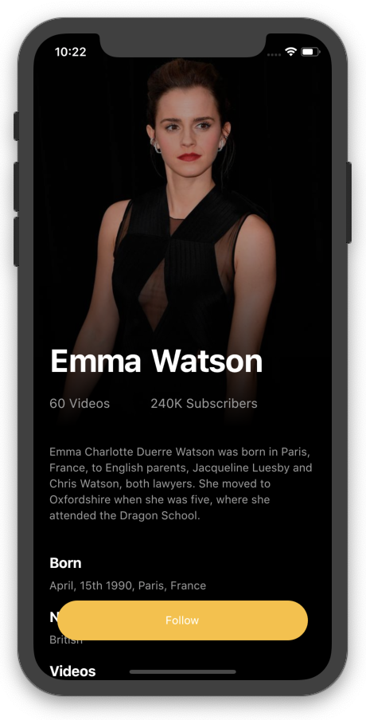
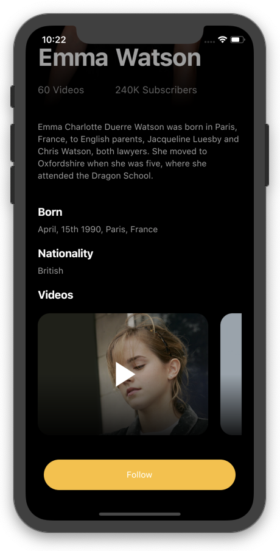
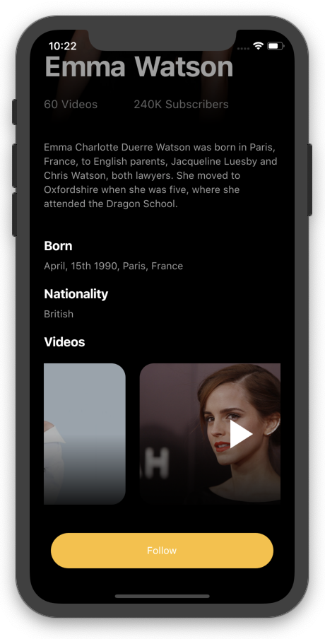

## Flutter Actors Profile Application Design - Day 4


[Youtube Video](https://youtu.be/3scHvCgi9iY)
<br><br>

## Development Setup
Clone the repository and run the following commands:
```
flutter pub get
flutter run
```

## ScreenShot




## Structure du Projet
- **lib/**: Contient le code source de l'application.

    - **main.dart**: Point d'entrée principal de l'application.

    - **pages/**:
        - **home_page.dart:** Page d'accueil qui affiche les informations du profil de l'acteur.

    - **animation/**:
        - **fade_animation.dart:** Définit une animation de fondu utilisée dans l'application.
    Description des fichiers
    
<details>
<summary> main.dart</summary>
Ce fichier est le point d'entrée principal de l'application Flutter.
Il contient la fonction main() qui appelle la méthode runApp() pour lancer l'application.
La classe MyApp étend StatelessWidget et retourne un MaterialApp avec HomePage comme écran principal.
</details>

<details>
<summary> home_page.dart </summary>

Ce fichier contient la classe HomePage qui affiche les détails du profil de l'acteur.
- **Classe HomePage**:
    La classe HomePage étend StatefulWidget et crée l'état avec _HomePageState.

- **Classe _HomePageState**:
    Définit l'interface utilisateur pour la page d'accueil en utilisant un Scaffold avec une SliverAppBar et une SliverList.
- **SliverAppBar**:
    Affiche une image de fond de l'acteur avec un gradient en superposition.
    Affiche le nom de l'acteur et quelques statistiques (vidéos et abonnés) avec l'animation de fondu.
- **SliverList**:
    Affiche des informations détaillées sur l'acteur, y compris sa biographie, sa date de naissance, sa nationalité et une liste de vidéos.
- **Méthode makeVideo**:
    Crée un widget pour afficher une vidéo avec une image de fond et un bouton de lecture en superposition.
</details>

<details>
<summary> fade_animation.dart </summary>

Ce fichier définit la classe FadeAnimation utilisée pour appliquer des animations de fondu à différents widgets.

**Classe FadeAnimation:**
La classe FadeAnimation étend StatelessWidget et prend deux paramètres : delay et child.
Utilise la bibliothèque `simple_animations` pour créer une animation de fondu avec un décalage.

**Méthode build:**
Définit un MovieTween pour l'animation de l'opacité et de la translation.
Utilise PlayAnimationBuilder pour animer le widget enfant avec les effets définis.
</details>
